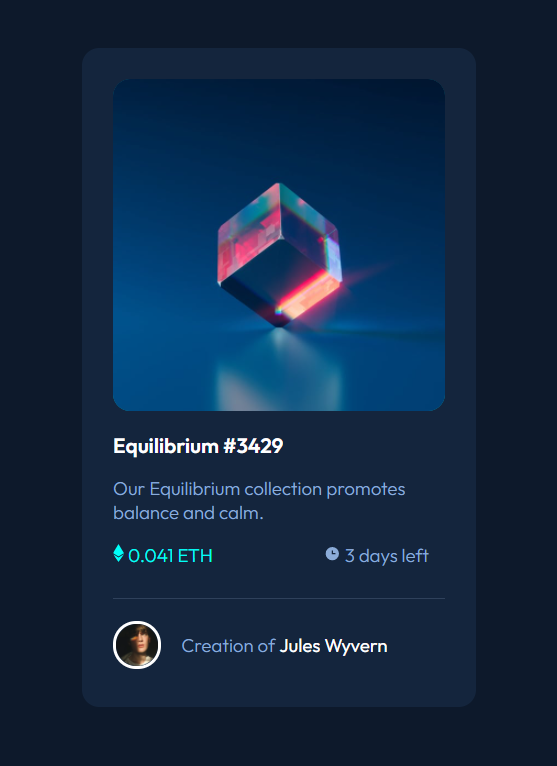

# Frontend Mentor - NFT preview card component solution

This is a solution to the [NFT preview card component challenge on Frontend Mentor](https://www.frontendmentor.io/challenges/nft-preview-card-component-SbdUL_w0U). Frontend Mentor challenges help you improve your coding skills by building realistic projects. 

## Table of contents

- [Overview](#overview)
  - [The challenge](#the-challenge)
  - [Screenshot](#screenshot)
- [My process](#my-process)
  - [Built with](#built-with)
  - [What I learned](#what-i-learned)
- [Author](#author)

**Note: Delete this note and update the table of contents based on what sections you keep.**

## Overview

### The challenge

Users should be able to:

- View the optimal layout depending on their device's screen size
- See hover states for interactive elements

### Screenshot

### Links

## My process

### Built with

- Semantic HTML5
- CSS custom properties
- Flexbox
- CSS Grid
- Mobile-first workflow
- -Git

### What I learned

I learned more about how to make a semantic code, use CSS to make somethings active only when people click at certain content.
Also, I was able to develop more my knowlodge about HTML and CSS. I'm trying to learn more about this two, to make easy to see what I need to code.

## Author

- Website - [Leonardo Alves](https://leoofalves.github.io/site-Leonardo-Alves/)
- Linkedin - [Leonardo Fontana Alves](https://www.linkedin.com/in/leoofalves/)
